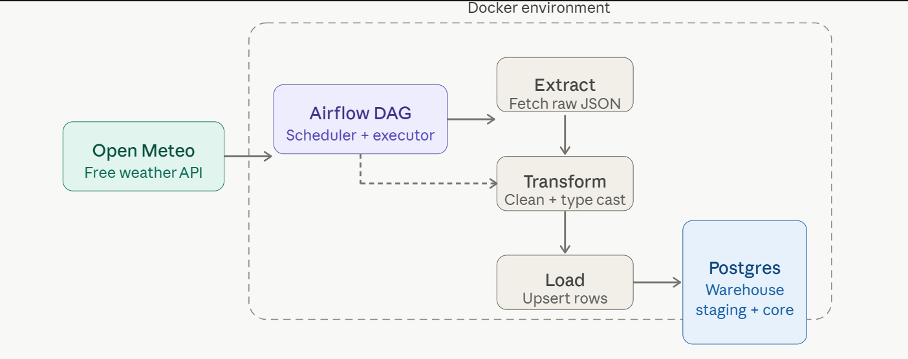

# Weather ETL Pipeline

A production-style batch ETL pipeline that fetches daily weather data from the [Open Meteo API](https://open-meteo.com/), transforms it, and loads it into a two-layer PostgreSQL warehouse — all orchestrated by Apache Airflow and containerized with Docker.

Built as a data engineering portfolio project demonstrating core DE skills: orchestration, warehouse schema design, idempotent pipelines, and containerization.

---

## Architecture



**Data flow:**
1. Airflow scheduler triggers the DAG once daily
2. `extract` task calls Open Meteo API for 4 cities, pushes raw JSON via XCom
3. `transform` task stages raw JSON into `staging.weather_raw`
4. `load` task parses staged records and upserts clean rows into `core.daily_weather`

---

## Tech Stack

| Tool | Version | Role |
|---|---|---|
| Apache Airflow | 2.8.1 | Orchestration, scheduling, task dependencies |
| PostgreSQL | 15 | Data warehouse (staging + core layers) |
| Docker + Compose | latest | Local containerized environment |
| Python | 3.8 | ETL logic, API calls, data transformation |
| Open Meteo API | — | Free public weather data source (no API key) |
| psycopg2 | 2.9.9 | Python ↔ Postgres driver |

---

## Project Structure

```
weather-etl/
├── dags/
│   └── weather_dag.py       # Airflow DAG: extract → transform → load
├── sql/
│   └── init.sql             # Warehouse schema (runs on first Postgres start)
├── logs/                    # Airflow task logs (git-ignored)
├── plugins/                 # Airflow plugins (empty, reserved)
├── docker-compose.yml       # Airflow + Postgres services
├── requirements.txt         # Python dependencies
└── README.md
```

---

## Database Schema

Two-layer warehouse pattern:

```sql
-- Layer 1: Raw staging (append-only, preserves original JSON)
staging.weather_raw
  id          SERIAL PRIMARY KEY
  fetched_at  TIMESTAMP
  city        VARCHAR
  latitude    FLOAT
  longitude   FLOAT
  date        DATE
  raw_data    JSONB          -- full API response stored as-is

-- Layer 2: Clean core (typed, deduplicated, ready for analytics)
core.daily_weather
  id                  SERIAL PRIMARY KEY
  city                VARCHAR
  date                DATE
  temp_max_c          FLOAT
  temp_min_c          FLOAT
  precipitation_mm    FLOAT
  wind_speed_max_kmh  FLOAT
  weather_code        INTEGER
  loaded_at           TIMESTAMP
  UNIQUE(city, date)          -- enables safe ON CONFLICT upserts
```

---

## How to Run

**Prerequisites:** Docker Desktop installed and running.

```bash
# 1. Clone the repo
git clone https://github.com/YOUR_USERNAME/weather-etl.git
cd weather-etl

# 2. Initialize Airflow (creates DB schema + admin user)
docker compose up airflow-init

# 3. Start all services
docker compose up -d

# 4. Open the Airflow UI
# http://localhost:8080  →  admin / admin
```

**Add the Postgres connection in Airflow UI:**

`Admin → Connections → + Add`

| Field | Value |
|---|---|
| Connection Id | `weather_postgres` |
| Connection Type | `Postgres` |
| Host | `postgres` |
| Database | `weather_db` |
| Login | `warehouse` |
| Password | `warehouse` |
| Port | `5432` |

```bash
# 5. Trigger the DAG manually (or wait for 6am UTC schedule)
docker compose exec airflow-scheduler airflow dags trigger weather_etl

# 6. Verify data loaded
docker compose exec postgres psql -U warehouse -d weather_db \
  -c "SELECT city, date, temp_max_c, temp_min_c, precipitation_mm FROM core.daily_weather ORDER BY city;"
```

**Tear down:**
```bash
docker compose down -v   # stops containers and removes volumes
```

---

## Sample Output

```
   city   |    date    | temp_max_c | temp_min_c | precipitation_mm
----------+------------+------------+------------+------------------
 London   | 2026-05-23 |       29.6 |       20.3 |                0
 New York | 2026-05-23 |       13.7 |        9.6 |              8.4
 Phoenix  | 2026-05-23 |       36.3 |       23.2 |                0
 Tokyo    | 2026-05-23 |       17.6 |       12.1 |                0
(4 rows)
```

---

## Cities Tracked

| City | Latitude | Longitude |
|---|---|---|
| Phoenix, AZ | 33.45 | -112.07 |
| New York, NY | 40.71 | -74.01 |
| London, UK | 51.51 | -0.13 |
| Tokyo, Japan | 35.69 | 139.69 |

To add more cities, edit the `CITIES` list in `dags/weather_dag.py` — no other changes needed.

---

## DAG Design

```
weather_etl (schedule: 0 6 * * *)
│
├── extract       PythonOperator — calls Open Meteo API, pushes JSON to XCom
│
├── transform     PythonOperator — stages raw JSON into staging.weather_raw
│
└── load          PythonOperator — parses staged rows, upserts into core.daily_weather
```

Key design decisions:
- **XCom for inter-task communication** — extract pushes raw data, transform/load consume it
- **Staging layer** — raw JSON is always preserved before transformation, enabling reprocessing
- **Idempotent loads** — `ON CONFLICT (city, date) DO UPDATE` means the DAG is safe to re-run or backfill without creating duplicates
- **Retry logic** — each task retries twice with a 5-minute delay on failure

---

## What I Learned

- **Airflow DAG design** — task dependencies with `>>`, XCom for passing data between tasks, scheduling with cron expressions
- **Two-layer warehouse schema** — separating raw staging from clean core tables is a real-world pattern used at companies like Airbnb and Spotify
- **Idempotent pipelines** — using `ON CONFLICT DO UPDATE` so pipelines can be safely re-run or backfilled without producing duplicate data
- **Docker Compose for local DE** — running a full Airflow + Postgres stack locally, understanding service health checks and dependency ordering
- **Postgres permissions model** — `GRANT` on tables vs sequences, schema-level vs table-level privileges
- **Debugging Airflow failures** — reading task instance logs, understanding retry states, using the UI to clear and re-run tasks

---

## Extending This Project

Ideas for taking this further:

- Add a `dbt` model on top of `core.daily_weather` for analytics aggregations
- Add Great Expectations data quality checks between transform and load
- Add email/Slack alerting on DAG failure using Airflow callbacks
- Backfill historical data using Airflow's catchup and `start_date`
- Deploy to a cloud Postgres instance (AWS RDS, Supabase) instead of local Docker

---

## License

MIT